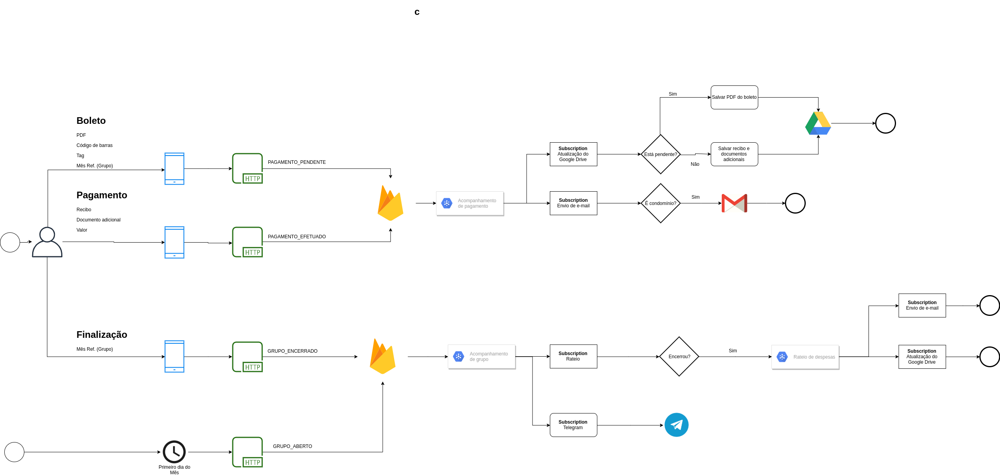

# The process flow
This is the process flow


# API

## Endpoints
### [POST] /bills
*Request*
```
{
    "description": "string",
    "document": ?,
    "barCode": "string",
    "tags": [
        "string",
        "string"
    ],
    "group": {
        "id": "the ref id"
    }
}
```
*Response*
```
{
    "id": "the new id",
    "status": "PENDING",
    "description": "string",
    "barCode": "string",
    "tags": [
        "string",
        "string"
    ],
    "group": {
        "id": "the ref id",
        "description": "the group description"
    }
}
```

### [GET] /bills/{bill_id}
*Response*
```
{
    "id": "the new id",
    "status": "PENDING|PAID",
    "description": "string",
    "barCode": "string",
    "tags": [
        "string",
        "string"
    ],
    "group": {
        "id": "the ref id",
        "description": "the group description"
    }
}
```

### [GET] /bills
*Response*
```
[
    {
        "id": "the new id",
        "status": "PENDING|PAID",
        "description": "string",
        "barCode": "string",
        "tags": [
            "string",
            "string"
        ],
        "group": {
            "id": "the ref id",
            "description": "the group description"
        }
    }
]
```

### [POST] /bills/{bill_id}/payments
*Request*
```
{
    "aditionalDocuments": [],
    "paymentDate": "",
    "amount": ""
}
```
*Response*
```
{
    "id": "the paid bill id",
    "status": "PAID",
    "description": "string",
    "barCode": "string",
    "tags": [
        "string",
        "string"
    ],
    "paymentDetails": {
        "paymentDate": "",
        "amount": ""
    }
    "group": {
        "id": "the ref id",
        "description": "the group description"
    }
}
```

### [POST] /groups
*Request*
```
{
    "id": "the new id",
    "description": "some description"
}
```
*Response*
```
{
    "id": "the new id",
    "description": "some description",
    "status": "OPENED"
}
```

### [POST] /groups/{group_id}/closed
*Request*
```
No body is needed
```
*Response*
```
{
    "id": "the new id",
    "description": "some description",
    "status": "CLOSED",
    "bills": [
        {
            "id": "the bill id",
            "description": "the bill description",
            "barCode": "",
            "status": "PAID",
            "tags": [ "tag1", "tag2" ],
            "paymentDetails": {
                "amount": "200.00",
                "paymentDate": "2019-01-01T10:00:00Z",
            }
        }
    ]
}
```

### [GET] /groups/{group_id}?status={OPENED|CLOSED}
*Response*
```
{
    "id": "the new id",
    "description": "some description",
    "status": "OPENED|CLOSED",
    "bills": [
        {
            "id": "the bill id",
            "description": "the bill description",
            "status": "PENDING|PAID",
            "barCode": "",
            "tags": [ "tag1", "tag2" ],
            "paymentDetails": {
                "amount": "200.00",
                "paymentDate": "2019-01-01T10:00:00Z",
            }
        }
    ]
    }
```


### [GET] /groups?status={OPENED|CLOSED}
*Response*
```
[
    {
        "id": "the new id",
        "description": "some description",
        "status": "OPENED|CLOSED",
        "bills": [
            {
                "id": "the bill id",
                "description": "the bill description",
                "barCode": "",
                "status": "PENDING|PAID",
                "tags": [ "tag1", "tag2" ],
                "paymentDetails": {
                    "amount": "200.00",
                    "paymentDate": "2019-01-01T10:00:00Z",
                }
            }
        ]
    }
]
```

# The database model
```
{
    "id": "string",
    "description": "string",
    "status": "OPENED|CLOSED"
    "bills": [
        {
            "id": "the bill id",
            "description": "the bill description",
            "status: "PENDING|PAID",
            "document": "",
            "barCode": "",
            "tags": [],
            "paymentDetails": {
                "amount": "",
                "aditionalDocuments": [
                    "",
                    ""
                ]
                "paymentDate": "2019-02-03"
            }
        }
    ]
}
```

# Pub/Sub services

### topic bill-tracking
```
{
    "id": "",
    "description": "",
    "status: "",
    "document": "",
    "barCode": "",
    "tags": [],
    "group": {
        "id": "",
        "description": ""
    }
    "paymentDetails": {
        "amount": "",
        "aditionalDocuments": [
            "",
            ""
        ]
        "paymentDate": "2019-02-03"
    }
}
```

### topic bill-group-tracking
```
{
    "id": "",
    "description": "",
    "status": "OPENED|CLOSED",
    "bills": [
        {
            "id": "",
            "description": "",
            "status": "",
            "tags": [],
            "paymentDetails": {
                "amount": "",
                "paymentDate": "date",
            }
        }
    ]
}
```